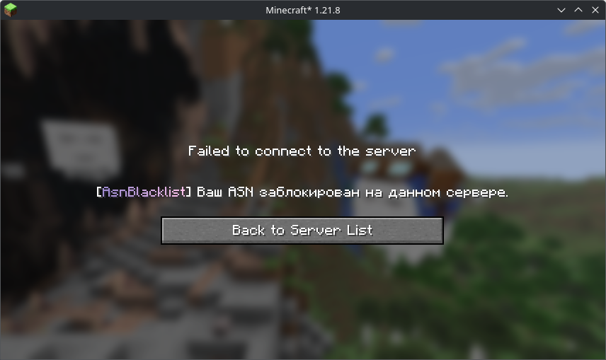
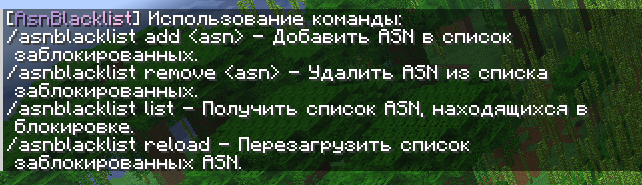

# AsnBlacklist

[README (English version)](./README_en.md)

---

[](https://openjdk.org/projects/jdk/17/)

Minecraft плагин для прокси Velocity и BungeeCord, предназначенный для блокировки IP адресов пользователей по **A**utonomous**S**ystem**N**umber **(ASN)**.
Блокировка по **ASN** позволяет серверам защититься от ботов на уровне L7. Заблокированные **ASN** указываются списком в конфигурации.

> [!WARNING]  
> Данное решение ~~является костылём~~ не гарантирует полноценную защиту от всех ботов,
> однако, оно корректно выполняет задуманный функционал.

## Загрузки

Официальные сборки доступны на [GitHub Releases](https://github.com/novitpw/asn-blacklist/releases).

## Локализация

Локализация находится в директории `translations` плагина, поддерживает формат [MiniMessage](https://docs.advntr.dev/minimessage/format.html).
Файлы локализации создаются автоматически при первом запуске.
Сообщение о блокировке пользователя по **ASN** настраивается с помощью ключа `asnblacklist.message.kick`.
> **Пример:**
>
> ```properties
> asnblacklist.message.kick=<lang:asnblacklist.prefix>Ваш ASN заблокирован на данном сервере.
> ```
>

[](images/disconnect_reason.png)

Если необходимо вывести сообщение с переносами строк, то необходимо использовать тег `<newline>`.
> **Пример:**
>
> ```properties
> asnblacklist.message.kick=<lang:asnblacklist.prefix><newline>\
>   Ваш ASN заблокирован на данном сервере.
> ```

## Конфигурация

Все форматы времени указываются в стандарте **ISO 8601**, например:

- `PT6H` → 6 часов
- `P3D` → 3 дня
- `P2DT3H4M` → 2 дня, 3 часа, 4 минуты

---

> ### asn-blacklist
>
> Список заблокированных ASN. Узнать информацию или получить номер ASN можно [на сайте bgp.tools](https://bgp.tools/)
>
> **Пример:**
>
> ```yaml
> asn-blacklist:
>   - "AS35048" # Значение с префиксом AS
>   - "53667" # Значение без префикса AS
> ```

---

> ### maxmind-database
>
> Настройки базы MaxMind.
>
> - `api-key` — Ключ API MaxMind. Конфигурация по умолчанию уже содержит действующий. При необходимости можно использовать собственный ключ, сгенерированный [на сайте MaxMind](https://www.maxmind.com/en/accounts/current/license-key).
> - `file` — Путь к локальному файлу базы данных.
> - `ttl` — Срок хранения локальной базы данных (в ISO 8601). После истечения срока база данных будет загружена повторно.
>
> **Пример:**
>
> ```yaml
> maxmind-database:
>   api-key: "apiKey"
>   file: "GeoLite2-ASN.mmdb"
>   ttl: "P3D"
> ```

---

> ### cache-ttl
>
> Продолжительность кэша для проверенных ASN (в ISO 8601).
>
> **Пример:**
>
> ```yaml
> cache-ttl: "PT12H"
> ```

---

## Команды

- `/asnblacklist` - Основная команда. Алиасы - `/asnbl`
- `/asnblacklist add <asn>` - Добавить ASN в список заблокированных.
- `/asnblacklist remove <asn>` - Удалить ASN из списка заблокированных.
- `/asnblacklist list` - Получить список ASN, находящихся в блокировке.
- `/asnblacklist reload` - Перезагрузить конфигурацию и локализацию.

[](images/commands.png)


## Сборка проекта

Для сборки данного проекта вам потребуется JDK 17 или выше.

Сборка осуществляется набором следующих команд:

```bash
git clone https://github.com/novitpw/asn-blacklist.git 
cd asn-blacklist
./gradlew build
```

После успешной сборки бинарные фалы JAR можно найти в директории `./output`.

## Поддержка и обратная связь

Используйте [трекер проблем GitHub](https://github.com/novitpw/ans-blacklist/issues) для сообщений об ошибках и предложений.

## Лицензия

Проект распространяется под [лицензией GNU GPL v3.0](./LICENSE).
