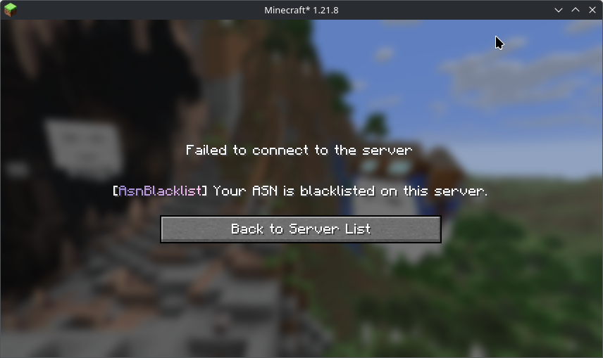
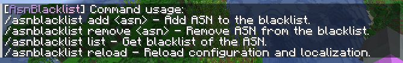

# AsnBlacklist (EN)

[README (Русская версия)](./README.md)

---

[](https://openjdk.org/projects/jdk/17/)

A Minecraft plugin for Velocity and BungeeCord proxies that blocks user IPs based on their **A**utonomous**S**ystem**N**umber **(ASN)**.
Protect your server against Layer 7 bot attacks with **ASN**-level filtering.

> [!WARNING]  
> This solution ~~is quick fix~~ does not guarantee complete protection against all bots,
> however, it correctly performs the intended functionality.

## Downloads

Official assemblies are available on [GitHub Releases](https://github.com/novitpw/asn-blacklist/releases).

## Localization

The localization files are located in the `translations` directory of the plugin and support the [MiniMessage](https://docs.advntr.dev/minimessage/format.html) format.
Localization files are generated automatically on the first plugin startup.
The message shown when a user is blocked by **ASN** can be configured using the `asnblacklist.message.kick` key.
> **Example:**
>
> ```properties
> asnblacklist.message.kick=<lang:asnblacklist.prefix>Your ASN is blacklisted on this server.
> ```
>

[](images/disconnect_reason_en.png)

If you need to display a message with line breaks, use the `<newline>` tag.
> **Example:**
>
> ```properties
> asnblacklist.message.kick=<lang:asnblacklist.prefix><newline>\
>   Your ASN is blacklisted on this server.
> ```

## Configuration

All duration formats must be specified using the standard **ISO 8601** format, for example:

- `PT6H` → 6 hours
- `P3D` → 3 days
- `P2DT3H4M` → 2 days, 3 hours, 4 minutes

---

> ### asn-blacklist
>
> Blacklisted ASN. You can look up information or obtain the ASN number [on website bgp.tools](https://bgp.tools/)
>
> **Example:**
>
> ```yaml
> asn-blacklist:
>   - "AS35048" # Value with the AS prefix
>   - "53667" # Value without the AS prefix
> ```

---

> ### maxmind-database
>
> MaxMind database settings.
>
> - `api-key` — MaxMind API key. The default configuration already includes a valid one. If necessary, you can use your own key generated [on the MaxMind website](https://www.maxmind.com/en/accounts/current/license-key).
> - `file` — Path to the local database file
> - `ttl` — Local database retention period (ISO 8601). After the retention period expires, the database will be downloaded again.
>
> **Example:**
>
> ```yaml
> maxmind-database:
>   api-key: "apiKey"
>   file: "GeoLite2-ASN.mmdb"
>   ttl: "P3D"
> ```

---

> ### cache-ttl
>
> Cache duration for verified ASNs (ISO 8601).
>
> **Example:**
>
> ```yaml
> cache-ttl: "PT12H"
> ```

---

## Commands

- `/asnblacklist` - Main command. Aliases - `/asnbl`
- `/asnblacklist add <asn>` - Add ASN to the blacklist.
- `/asnblacklist remove <asn>` - Remove ASN from the blacklist.
- `/asnblacklist list` - Get blacklist of the ASN.
- `/asnblacklist reload` - Reload configuration and localization.

[](images/commands_en.png)


## Building

To build this project, you will need JDK 17 or higher.

The build can be performed using the following commands:

```bash
git clone https://github.com/novitpw/asn-blacklist.git 
cd asn-blacklist
./gradlew build
```

After a successful build, the JAR binary files can be found in the `./output` directory.

## Support and Feedback

Please use the [GitHub issue tracker](https://github.com/novitpw/ans-blacklist/issues) to report bugs and submit suggestions.

## License

The project is licensed under [GNU GPL v3.0 license](./LICENSE).
